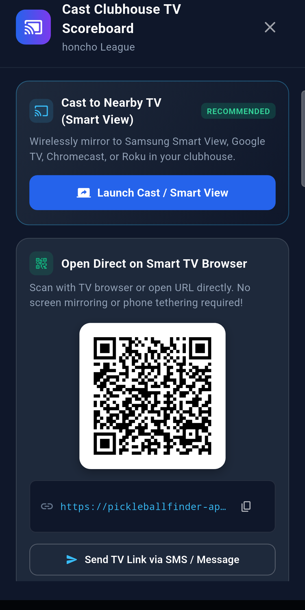

# 🏓 Pickleball Finder

[](https://flutter.dev)
[](https://dart.dev)
[](https://firebase.google.com)
[](https://flutter.dev)
[](https://github.com/andrewrelic/pickleball-finder)

**Pickleball Finder** is a comprehensive, cross-platform mobile and web application built for the pickleball community. Whether you're traveling to a new city, checking court availability before leaving the house, connecting with local players, or running a weekend round-robin tournament, Pickleball Finder provides everything you need in one unified experience.

---

## 🌟 What the App Does

Pickleball Finder connects pickleball players of all skill levels with courts, real-time information, and each other across the entire United States.

```
                  ┌────────────────────────────────────────┐
                  │           PICKLEBALL FINDER            │
                  └───────────────────┬────────────────────┘
                                      │
       ┌──────────────────────────────┼──────────────────────────────┐
       │                              │                              │
       ▼                              ▼                              ▼
┌──────────────┐              ┌──────────────┐              ┌──────────────┐
│  DISCOVER    │              │     WATCH    │              │   CONNECT    │
│  & NAVIGATE  │              │  LIVE CAMS   │              │   & COMPETE  │
├──────────────┤              ├──────────────┤              ├──────────────┤
│• 50 States   │              │• Real-Time   │              │• DUPR Rating │
│  + DC (100+) │              │  Court Views │              │• QR Friend   │
│• GPS Haversine              │• Live Stream │                Profiles     │
│  Distance    │              │  Launcher    │              │• Round Robin │
│• Direct Map  │              │• Crowd &     │                Tournaments  │
│  Directions  │              │  Weather Check│             │• Game Meetups│
└──────────────┘              └──────────────┘              └──────────────┘
```

---

## 🚀 Key Features

### 📍 Nationwide Court Directory & Interactive Map
- **Complete 50-State + D.C. Coverage**: Features over **5,000+ curated pickleball venues**, guaranteeing at least **100+ verified locations per state** (and complete district-wide DPR park coverage in Washington, D.C.).
- **Interactive Mapping**: Seamlessly view courts on an interactive map with custom pins indicating court types, tap-to-focus clustering, and immediate location centering.
- **Smart Distance Calculations**: Calculates real-time distance from your current GPS position to any court using high-precision Haversine algorithms.
- **Turn-by-Turn Navigation**: One-tap navigation launching your preferred navigation app (Google Maps, Apple Maps, Waze).

### 📹 Real-Time Live Court Cameras
- **Live Video Streaming**: Watch real-time court cameras before heading out to check crowd levels, active games, and court surface conditions.
- **LivePickleballCourts & EarthCam Integration**: Direct streaming access to verified live camera feeds across dozens of major facilities nationwide.
- **Live Stream Badging**: Locations with streaming cameras display an animated, high-visibility **`LIVE CAM`** indicator directly on the court cards and detail views.

### 🔎 Search, Filter & Favorites
- **Instant Search**: Search courts by city name, state abbreviation, venue title, or ZIP code.
- **Filter by Venue Type**: Easily toggle between public parks, private clubs, commercial facilities, indoor centers, and community recreation courts.
- **Save Favorites**: Bookmark your favorite home courts for instant one-tap access.

### 🤝 Social Networking & DUPR Player Profiles
- **Player Profiles**: Customize your profile with your pickleball bio, preferred play style, and skill rating (1.0 – 6.0).
- **DUPR Rating Integration**: Connect and display your official Dynamic Universal Pickleball Rating (DUPR).
- **QR Code Friend Scanning**: Add playing partners on the court instantly by scanning their unique in-app QR code or sharing a personal deep link.
- **Friends Activity**: View your pickleball network and coordinate matches with frequent partners.

### 📅 Game Scheduling & Community Announcements
- **Game Meetups**: Schedule court sessions, create open play invitations, and invite friends.
- **Court Announcements**: Post and view real-time updates regarding court maintenance, net status, paddle rotations, and tournament events.
- **Weather Insights**: View current weather conditions and forecasts right on the court detail screen.

### 🏆 Round Robin & Tournament Manager
- **Automated Match Generator**: Organize friendly round-robin tournaments or competitive brackets directly from the app.
- **Fair Rotation Algorithms**: Automatically schedules rotating doubles pairs and opponents so everyone gets balanced court time without manual paperwork.
- **Organizer Roster Management**: Dynamically edit rosters, substitute players, and regenerate schedules on the fly.

### 📺 Clubhouse TV Scoreboard Mode & Wireless Casting
- **Stadium Broadcast Layout**: Turn any wall-mounted TV, monitor, or projector into a live stadium-grade tournament scoreboard with active court matches, real-time score updates, and live leaderboard standings.
- **Wireless Screen Casting (Samsung Smart View & Google Cast)**: Built specifically for mobile devices — 1-tap launcher to wirelessly stream your scoreboard directly to Samsung Smart TVs, Chromecasts, Google TVs, and wireless displays.
- **Autonomous Smart TV Display via QR Code**: No phone mirroring needed! Point any Smart TV browser, Apple TV, Fire TV, or clubhouse computer at the scannable QR code to run the live 4K Scoreboard autonomously without draining your phone's battery.
- **1-Tap Share & Remote Control**: Send direct scoreboard display links to clubhouse staff or TV operators via SMS or messaging.
- **Real-Time Live Sync**: Cloud Firestore streams live court scores and round rotations in real-time. When desk staff records a score on mobile or tablet, the TV display updates instantly.

<p align="center">
  
</p>

---

## 📱 Supported Platforms

- **Android** (Phones & Tablets)
- **iOS** (iPhones & iPads)
- **Web** (Chrome, Safari, Firefox, Edge)
- **Desktop** (macOS, Windows, Linux)

---

## 🛠️ Tech Stack & Architecture

- **Frontend**: [Flutter](https://flutter.dev) & [Dart](https://dart.dev) (Responsive Material Design 3)
- **State Management**: [Provider](https://pub.dev/packages/provider) architecture for predictable, reactive UI updates
- **Maps & Location**: `google_maps_flutter`, `geolocator`, and `map_launcher`
- **Backend & Cloud**: [Firebase](https://firebase.google.com)
  - Firebase Authentication (Email/Password, Google Sign-In, Guest mode)
  - Cloud Firestore (Real-time user data, friends, favorites, and announcements)
  - Firebase Storage & Cloud Functions
- **Data Synchronization**:
  - **Offline-First**: Packaged with local asset data bundles (`assets/data/locations-*.csv`) for instant startup and offline capability.
  - **Live Cloud Sync**: Seamlessly falls back to and fetches updated remote datasets from GitHub raw repositories for continuous data freshness.
- **Video & Camera Feeds**: Integrated with [LivePickleballCourts.com](https://livepickleballcourts.com) and EarthCam public streaming APIs.

---

## 📦 Getting Started

### Prerequisites
- [Flutter SDK](https://docs.flutter.dev/get-started/install) (`>= 3.3.0`)
- [Dart SDK](https://dart.dev/get-dart)
- Android Studio / Xcode / VS Code with Flutter extension
- A modern web browser (for Web execution)

### Installation

1. **Clone the repository**:
   ```bash
   git clone git@github.com:andrewrelic/pickleball-finder.git
   cd "Pickleball finder"
   ```

2. **Install dependencies**:
   ```bash
   flutter pub get
   ```

3. **Run the app**:
   ```bash
   # Run on connected device or simulator
   flutter run

   # Or run on Chrome
   flutter run -d chrome
   ```

4. **Run test suite**:
   ```bash
   flutter test
   ```

---

## 📄 License

This project is licensed under the MIT License — see the repository for details.
